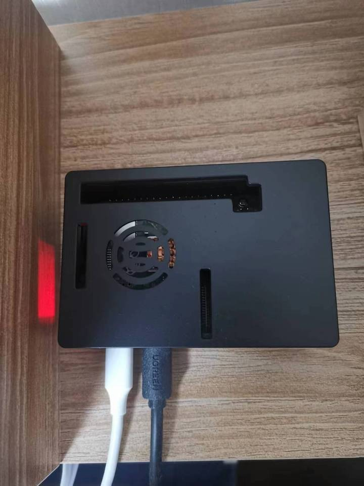
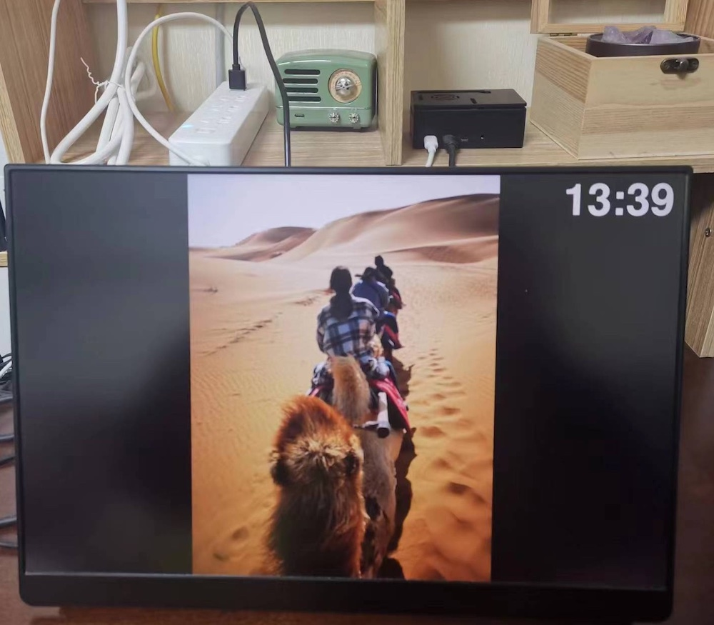

# electronic_picture_frame
A project of electronic picture frame based on raspberry pi + HDMI screen

## Hardwares

Basically you can choose any model of raspberry pi and screen, as long as the performance and space are enough.

I use raspberry pi 4B+ and a 16-inch 2560x1600 QLED screen with HDMI interface.

## Installation and Usage

Please run with Python3.

```
pip install -r requirements.txt
python main.py
# copy your pictures to the images/ folder
# use your own voice for hour reporting
# copy xxx.mp3 to hour_reporting/08/, hour_reporting/09/, etc
```

## Code Structure

frame_config.py: configuration loader

frame_hour_reporting.py: hour reporting manager to deal with mp3

frame_image_manager.py: image manager to preprocess images

frame_ui.py: UI for image and text display

main.py: application entry

## Demo





## Todo
- [x] Hour reporting (use your own voice)
- [ ] Display geographic location / text of the photo

For more details you can check [this](https://home.9hz.cool:18181/duo-gong-neng-dian-zi-xiang-kuang/).